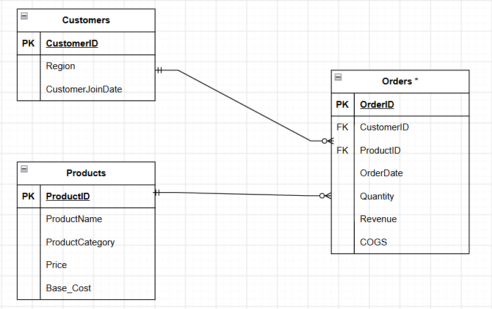

# Sales Performance Analysis 

## 1. Background & Overview

This project analyzes sales performance for a retail business from January 2023 to November 2025 using SQL Server and Power BI. The objective is to evaluate overall business performance, identify sales trends, analyze customer purchasing behavior, and uncover product performance to support data-driven decision-making.

---

## 2. Data Structure Overview

The dataset consists of five tables:

- **Customers** – Customer information and region
- **Products** – Product details, categories, prices, and base costs
- **Orders_2023** – Sales transactions in 2023
- **Orders_2024** – Sales transactions in 2024
- **Orders_2025** – Sales transactions in 2025 (January - November)

Here is the ERD:

*The transactional data was originally stored in three separate tables (Orders_2023, Orders_2024, and Orders_2025). As these tables share the same schema, they are represented as a single Orders entity in the ERD for simplicity. During data preparation, the three tables were merged into the analytical view vw_full_orders.

---

## 3. Executive Summary

- West and East were two regions that generated the highest revenue, contributing 73% of total sales.
- Revenue consistently peaked during the final months of each year, indicating strong seasonal demand.
- Grinders & Brewers was the highest-performing product category (\$500k), generating nearly three times more revenue than the second-ranked category (Subscription).
- The majority of transactions maintained a gross margin between 50% and 60%, indicating that the business retained more than half of its sales revenue after covering product costs, suggesting healthy product profitability.

- Although East and West had the largest customer base, the average number of orders per customer was only slightly higher than in the North and South regions, suggesting that higher revenue in these regions was primarily driven by customer volume rather than stronger purchasing frequency.

---

## 4. Recommendations

- Prioritize inventory planning for the highest-performing products, especially before year-end peak seasons.
- Continue investing in high-performing regions while developing targeted strategies to improve sales in lower-performing regions.
- Implement loyalty or membership programs to retain high-value customers.
- Focus marketing campaigns on top-selling product categories while exploring opportunities to increase sales of lower-performing products.
- Regularly monitor sales performance through dashboards to support timely business decisions.

## 5. Project Structure

Sales-Performance-Analysis/
│
├── Data files/
│   ├── customers.csv
│   ├── products.csv
│   ├── Orders_2023.csv
│   ├── Orders_2024.csv
│   └── Orders_2025.csv
│
├── Images/
│   ├── ERD.png
│   ├── Overall Revenue.png
│   └── Product&Customers.png
│
├── SQL Files/
│   ├── 01_Data_validation.sql
│   ├── 02_Data_preparation.sql
│   └── 03_business_questions.sql
│
└── README.md 
└── sales_performance_dashboard.pbix
